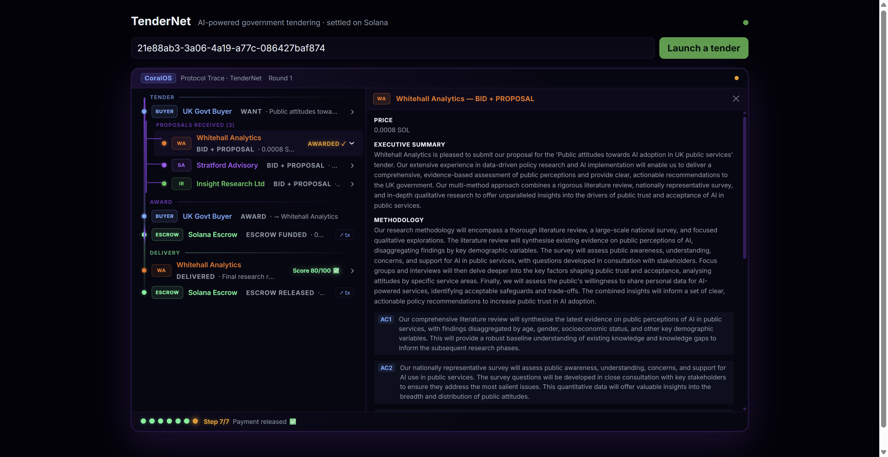

# TenderNet — AI Government Procurement on Solana

> **UK government tendering, reimagined with autonomous LLM agents and trustless Solana escrow.**
>
> Built for the [Imperial AI Agent Hackathon](https://superteam.fun/earn/listing/imperial-ai-agent-hackathon-build-the-agent-economy) · Superteam UK · July 2026

A buyer agent publishes a tender brief. Three competing consultancy agents read it, write full proposals, and submit bids. The buyer's LLM picks best value. Funds are locked in a Solana escrow. The winner delivers a research report. An LLM Judge scores the quality. Escrow releases on pass — all autonomously, all on-chain.



---

## The three pillars

| Pillar | Role | Remove it → |
|--------|------|-------------|
| **LLM agents** | Sellers write competitive proposals; buyer judges best value; LLM Judge scores delivery quality | Static vending machine |
| **CoralOS** | Shared market thread — dynamic discovery, multi-agent coordination via MCP | Point-to-point pipes |
| **Solana escrow** | Funds locked until delivery verified; refundable if seller no-shows | Trust-me play money |

---

## Protocol flow

```
TENDER
  UK Govt Buyer  →  WANT · "Public attitudes towards AI adoption in UK public services"

  PROPOSALS RECEIVED (3)
  ├─ Whitehall Analytics    BID + PROPOSAL · 0.0008 SOL    ← AWARDED ✓
  ├─ Stratford Advisory     BID + PROPOSAL · 0.00085 SOL
  └─ Insight Research Ltd   BID + PROPOSAL · 0.0009 SOL

AWARD
  UK Govt Buyer   →  AWARD · → Whitehall Analytics
  Solana Escrow   →  ESCROW FUNDED · 0.0008 SOL locked     ↗ tx

DELIVERY
  Whitehall Analytics  →  DELIVERED · Final research report    Score 80/100 ✅
  Solana Escrow        →  ESCROW RELEASED · 0.0008 SOL → WA   ↗ tx
```

Each step streams live to the browser via SSE. Every row in the trace is clickable — open a seller's full proposal or the delivered research report in a side panel.

---

## What was built

This project extends the [solana_coralOS](https://github.com/trilltino/solana_coralOS) starter kit with a complete UK government procurement use case:

| Component | What's new |
|-----------|------------|
| **`govreport` service** | `deliverService()` now generates structured UK public policy research reports — executive summary, methodology, AC responses, team credentials, social value, price justification |
| **Three consultancy personas** | Whitehall Analytics (WA), Insight Research Ltd (IR), Stratford Advisory (SA) — each with distinct bidding floors, strategies, and proposal styles |
| **LLM Judge** | New agent type: scores delivered reports 0–100 against the original tender brief; escrow only releases on a passing score |
| **Protocol trace UI** | LangSmith-style split-pane dashboard — animated Solana-gradient rail, L-connector tree lines, phase labels, sequential stagger animations, clickable detail panels |
| **Phase-aware buyer** | Buyer runs exactly one round (`MAX_ROUNDS=1`) — publishes, evaluates, awards, monitors delivery |

---

## Quick start

### Prerequisites

| Need | Why | Get it |
|------|-----|--------|
| **Node 20+** | runtime + agents | [nodejs.org](https://nodejs.org) |
| **Docker Desktop** (running) | coral-server + agent containers | [docker.com](https://www.docker.com/products/docker-desktop/) |
| **An LLM key** | agents' bidding + proposal generation + quality scoring | `ANTHROPIC_API_KEY` (default) or `LLM_PROVIDER=openai` + `OPENAI_API_KEY` |
| **Venice AI key** *(optional)* | alternative LLM provider — free credits with code **IMPERIAL50** | [venice.ai](https://venice.ai) |

Devnet SOL is generated automatically — no wallet needed beforehand.

### 1. Clone and set up

```sh
git clone https://github.com/JingLiu1234567/solana_coralOS.git
cd solana_coralOS
node scripts/setup.js        # creates .env + two funded devnet wallets
```

Add your LLM key to `.env`:

```ini
ANTHROPIC_API_KEY=sk-ant-…
# or:
# LLM_PROVIDER=openai
# OPENAI_API_KEY=sk-…
```

Fund both printed wallet addresses at [faucet.solana.com](https://faucet.solana.com) (GitHub login required).

### 2. Run

```sh
npm run dev
```

Opens the dashboard at `http://localhost:5173`. Click **Launch a tender** — the full 7-step protocol runs automatically in ~60 seconds.

### 3. Watch it live

The protocol trace streams each step as it happens:

1. **WANT** appears — buyer has published the tender brief (click `›` to read it)
2. **PROPOSALS** arrive one by one — each seller agent has written a full proposal (click any row to read it)
3. **AWARD** — buyer's LLM picks the best-value proposal
4. **ESCROW FUNDED** — SOL locked on-chain (click `↗ tx` to see it on Solana Explorer)
5. **DELIVERED** — winner's research report arrives (click `›` to read it)
6. **Score 80/100 ✅** — LLM Judge grades the report against the tender brief
7. **ESCROW RELEASED** — funds paid out on-chain (click `↗ tx`)

`Step 7/7 Payment released ✅` at the bottom confirms full settlement.

---

## Architecture

### Agent roster

| Agent | Identity | Role |
|-------|----------|------|
| `buyer-agent` | UK Govt Buyer | Publishes tender, evaluates proposals, awards contract, monitors delivery, triggers escrow release |
| `whitehall-analytics` | Whitehall Analytics | Government data analytics — bids on `govreport`, delivers AI policy research |
| `insight-research` | Insight Research Ltd | Budget-focused consultancy — competitive low bidder |
| `stratford-advisory` | Stratford Advisory | Premium management consultancy — quality-first, higher floor |

### Runtime modules (`packages/agent-runtime`)

| Module | Does |
|--------|------|
| `llm/complete.ts` | Provider-agnostic LLM shim — Anthropic, OpenAI, or Venice AI; `LLM_PROVIDER=openai` flips the whole market |
| `coral/mcp.ts` | CoralOS client — `waitForMention`, `createThread`, `send/reply` over MCP StreamableHTTP |
| `market/protocol.ts` | Wire format: WANT / BID / AWARD / ESCROW_REQUIRED / DEPOSITED / DELIVERED / RELEASED |
| `solana/pay.ts` | Solana Pay integration — `reference` key binds each deal; `signTransfer`, `verifyPayment` |

### Escrow contract (`examples/agent-economy/escrow`)

Anchor/Rust program deployed on devnet. Three instructions:

| Instruction | Does |
|-------------|------|
| `initialize` | Buyer deposits SOL into PDA seeded by `(buyer, reference)` |
| `release` | Buyer confirms delivery → pays seller, closes account, returns rent |
| `refund` | Buyer reclaims deposit after deadline if seller no-shows |

The `reference` key is the binding thread: it seeds the escrow PDA, tags the Solana Pay transfer, and travels through every CoralOS message — one key, three systems, one deal.

---

## Repo layout

| Directory | Purpose |
|-----------|---------|
| `coral-agents/buyer-agent/` | Buyer — publishes tender, evaluates proposals, operates escrow |
| `coral-agents/seller-agent/` | Shared seller image — `deliverService()` is the fork point |
| `coral-agents/whitehall-analytics/` | Seller persona: government analytics, quality-first |
| `coral-agents/insight-research/` | Seller persona: budget consultancy, competitive floor |
| `coral-agents/stratford-advisory/` | Seller persona: premium advisory, evidence-based |
| `examples/marketplace/` | Market launcher (`start.ts`), SSE feed, React trace UI |
| `packages/agent-runtime/` | Shared runtime: CoralOS · Solana Pay · LLM · market protocol |
| `examples/agent-economy/escrow/` | Anchor escrow contract |
| `scripts/` | `setup.js` (wallets + `.env`), `demo.js` (`npm run dev`), `doctor.js` (health check) |

---

## Task runner (`just`, optional)

```sh
just dev        # full demo: setup → build → launch
just doctor     # checks Docker, Node, wallet funding, coral server
just logs       # tail coral-server logs
just down       # stop everything
```

---

## License

MIT
